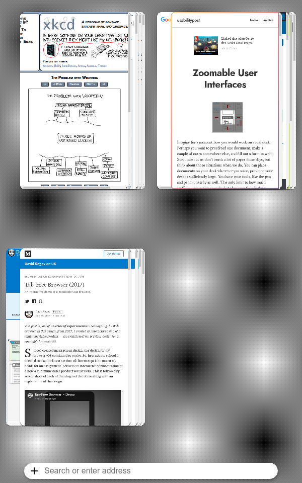

# Flow
*The zoomable Web browser that automatically organizes your tasks.*

## About Flow
Flow is a Web browser that I built as a [Chrome app](https://developer.chrome.com/docs/apps/) for my master’s thesis. It demnstrates *the right* solution to the “too many tabs” problem.

[**Flow Browser**: The zoomable Web browser that automatically organizes your tasks](https://medium.com/david-regev-on-ux/flow-browser-b730daf0f717): read more about Flow, watch the demo, or watch my thesis presentation.

## Installing Flow
Download the code and follow [Google’s instructions](https://developer.chrome.com/docs/apps/app_codelab_basics/#developer-mode).

## The Future of Flow
Flow was built to be a proof-of-concept, but I would love to turn it into a real Web browser! If you’d like to help, feel free to [contact me](mailto:david@davidregev.com)!

## Screenshot

